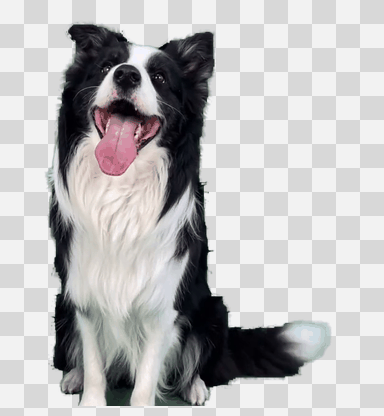
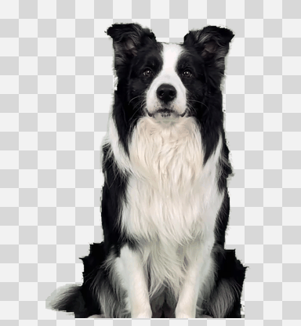
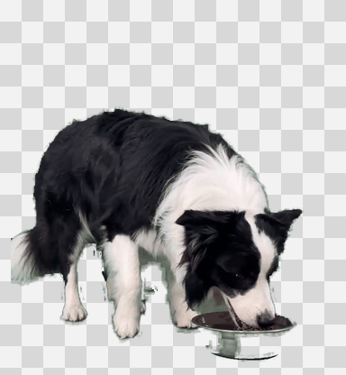
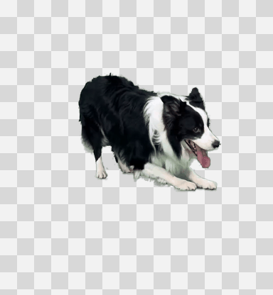
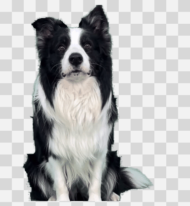
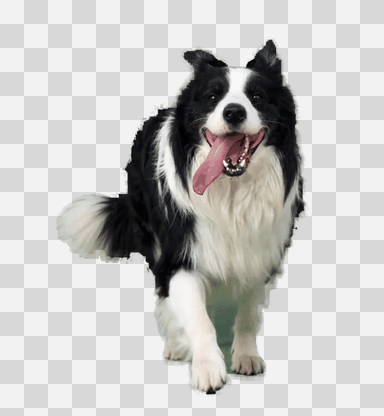
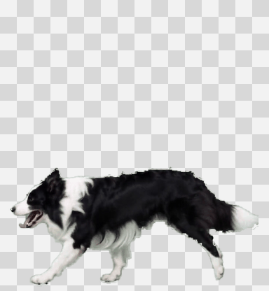
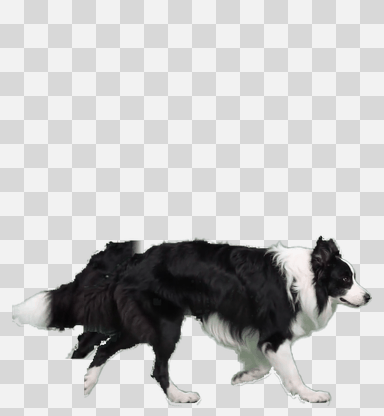
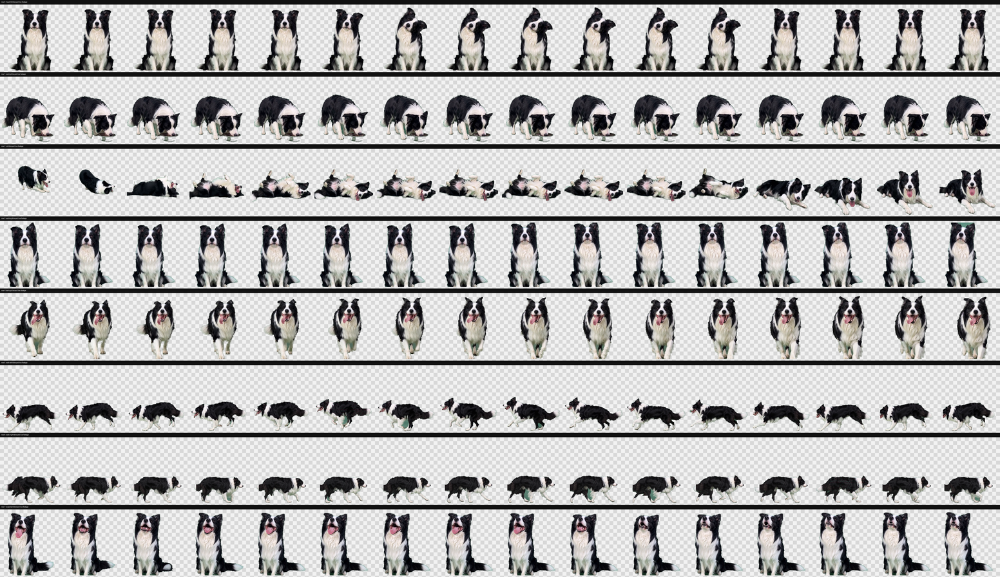

# Desktop Pet – Desktop Puppy / 桌面宠物-桌面小狗

> A tiny border collie who lives on your Mac desktop. No feeding, no mandatory petting, and no death mechanic—just permanent, pressure-free companionship.

> 一只生活在 Mac 桌面上的边牧妹妹。不需要喂养，不要求抚摸，也不会死亡：她会一直陪着你，但不会成为新的负担。

<p align="center">
  
</p>

<p align="center">
  <strong>Latest real-dog edition · macOS desktop app · Codex v2 pet · reusable Codex Skill</strong><br>
  <strong>最新版真实小狗动作 · macOS 桌面 App · Codex v2 宠物 · 可复用 Codex Skill</strong>
</p>

[English](#english) · [中文说明](#中文说明)

---

<a id="english"></a>

## English

### What is Meimei?

Meimei (妹妹) is a small border collie companion for macOS. She rests in a corner of your desktop, walks around occasionally, reacts to your mouse, tells cold jokes, and reminds you to move and drink water during long work sessions.

Her desktop animations are keyed frame by frame from the latest supplied green-screen dog clips. The dog, movement, eating bowl, and full-body poses are preserved; the green background is removed and the result is packed into a transparent, lossless animation atlas.

Meimei is not a virtual-pet game:

- No hunger bar, health bar, coins, levels, or daily check-in.
- No feeding or petting is required.
- She never becomes sick, ages, or dies when you are away.
- Everything runs locally, with no account, telemetry, ads, or online AI calls.

### See the latest Meimei

| Head tilt | Eating | Rolling / belly-up | Waiting |
| --- | --- | --- | --- |
|  |  |  |  |

| Startup | Walk left | Walk right | Expectant / approach |
| --- | --- | --- | --- |
|  |  |  |  |

These previews show the same transparent real-dog rows used by the desktop app. The original source videos are not bundled or uploaded.

### Quick start

Requirements: Apple Silicon Mac and macOS 13 or later.

```bash
git clone https://github.com/ielcharme/desktop-pet-dog.git
cd desktop-pet-dog

# Check the app, signature, architecture, and animation assets
./scripts/verify_assets.sh

# Preview the install destination without changing files
./scripts/install.sh --target desktop --dry-run

# Install Meimei to ~/Applications/妹妹.app
./scripts/install.sh --target desktop --install

# Launch her
open "$HOME/Applications/妹妹.app"
```

After launch, a paw icon appears in the macOS menu bar. Meimei does not add herself to Login Items.

### How to interact

| You do | Meimei does |
| --- | --- |
| Single-click her | Plays a relaxed interaction such as head tilt, rolling, or an expectant look |
| Double-click her | Tells an offline cold joke in a speech bubble |
| Move the pointer back and forth over her | Recognizes the petting gesture and comes closer with an expectant look |
| Drag her upward | Follows the pointer with the expectant/approach animation, then drops naturally |
| Drag her to a bottom corner | Stays there; after five quiet minutes, retreats into the screen edge |
| Hover over the visible edge peek | Hops back out and waits in the same corner |
| Right-click her | Offers **Temporarily Quit Meimei** |
| Use the paw menu | Recall, play, choose an action, ask for a joke, pause, hide, enable Cinema Mode, or quit |

Temporarily quitting closes the app without uninstalling it. Open `~/Applications/妹妹.app` whenever you want her back.

### A calmer, more natural routine

- Meimei spends most of her time resting; ordinary autonomous decisions are separated by `10–22 seconds`.
- Walking left, walking right, waiting, head tilt, startup, expectant, eating, and rolling all use the latest real-dog animation rows.
- After `3 minutes` without direct interaction, she performs one continuous mini-story: **walk left → head tilt → roll → walk right**.
- While the Mac is actively used, rolling/belly-up also appears naturally about every `5–10 minutes`.
- A roll lasts about `8.6 seconds`, including a `4-second` belly-up hold before she changes pose.
- Eating occurs only during three local-time meal windows: `08:30–09:00`, `12:00–12:30`, and `19:00–19:30`.
- Offline cold jokes may appear occasionally, or immediately when you double-click her.

### Rest and water reminders

Once per hour, Meimei checks whether the Mac was actively used during the previous five minutes. If you are working, she shows a short desktop speech bubble asking you to stand up for 2–5 minutes and drink some water.

- The bubble disappears automatically after `10 seconds`.
- If you are typing, she waits until the keyboard has been quiet for about `3 seconds`.
- The reminder is skipped when the Mac is idle, Meimei is paused or hidden, a full-screen window is active, or Cinema Mode is on.
- If she was hiding in the screen edge, she returns there after the reminder.

### She avoids your work area

Meimei is designed to step aside when attention matters:

- Hides while you type and returns after about three quiet seconds.
- Hides when the foreground window is full-screen.
- Hides for Apple TV, QuickTime Player, VLC, IINA, and other recognized media players.
- Provides a manual **Cinema Mode** for windowed browser video without inspecting page content.

### Desktop app, Codex pet, and Skill

This repository contains three related pieces:

| Component | Purpose |
| --- | --- |
| macOS desktop app | The small real-dog companion that walks, plays, hides, jokes, and gives wellness reminders |
| Codex v2 pet | A separate validated `8 × 11` illustrated atlas whose animations follow Codex task states |
| Codex Skill | Instructions and scripts for installing, verifying, rebuilding, or restoring Meimei |

The desktop app uses the latest real-dog video atlas. The Codex pet keeps its own v2 atlas for Codex compatibility; the app does not flash back to it as a desktop fallback.

Install only the Codex pet:

```bash
./scripts/install.sh --target codex --dry-run
./scripts/install.sh --target codex --install
```

Install both versions:

```bash
./scripts/install.sh --target all --dry-run
./scripts/install.sh --target all --install
```

Install the reusable Skill:

```bash
npx -y skills add https://github.com/ielcharme/desktop-pet-dog
```

Example request:

```text
Use $meteor-meimei-pet to install and launch Meimei as my macOS desktop pet.
```

### Update an installed copy

The installer does not silently overwrite an existing app. To replace it deliberately:

```bash
./scripts/install.sh --target desktop --install --replace
./scripts/verify_assets.sh --installed desktop
```

The public installer first moves the old copy to a timestamped sibling backup.

### Motion quality and size

- Small resting width: `97 px`.
- Walking and rolling scale: `1.5×`, anchored from the bottom center so the complete body remains visible.
- Eight real-dog actions, each using `16` ordered source frames.
- Lossless desktop atlas: `6144 × 3328`, with `384 × 416` cells.
- App refresh: `60 Hz`, with alpha-preserving adjacent-frame blending.
- Action transition: completed start/end poses plus a `0.62-second` terminal-to-entry crossfade.
- Walking uses tracked baseline normalization and screen-pixel alignment to reduce small-size jitter.
- The supplied right-walk clip had a cropped tail; only that missing area is completed from mirrored real-tail pixels in the paired left-walk clip.

<details>
<summary>Open the full real-dog action contact sheet</summary>



</details>

### Privacy

Meimei is local-only:

- No network requests, telemetry, advertising, online AI, microphone, camera, or screen recording.
- No access to Codex conversations, browser pages, accounts, credentials, or the contents of typed keys.
- She reads only anonymous time-since-input, frontmost app identity, and window geometry for reminders and focus protection.
- No Accessibility permission and no automatic Login Item.

### Build and verify from source

Requires macOS 13 or later and Xcode Command Line Tools.

```bash
./scripts/build_desktop_app.sh
./scripts/verify_assets.sh --app dist/妹妹.app
```

The output is `dist/妹妹.app`. It is locally ad-hoc signed, not Apple Developer ID signed or notarized.

### Repository map

```text
desktop-pet-dog/
├── SKILL.md                         # Codex Skill instructions
├── agents/openai.yaml               # Skill metadata and default prompt
├── assets/
│   ├── desktop/妹妹.app.zip         # Prebuilt Apple Silicon app
│   ├── desktop-preview/             # Latest real-dog GIFs and visual QA
│   ├── desktop-source/              # Reviewable Objective-C source
│   └── pet/                         # Separate Codex v2 pet atlas
├── references/asset-contract.md     # Size, motion, behavior, and privacy contract
└── scripts/
    ├── install.sh
    ├── verify_assets.sh
    └── build_desktop_app.sh
```

---

<a id="中文说明"></a>

## 中文说明

### 妹妹是做什么的？

妹妹是一只会生活在 Mac 桌面上的小型边牧。她会安静待机、偶尔散步、回应鼠标互动、讲冷笑话，并在你长时间工作时提醒起身活动和喝水。

桌面版已经换成最新版真实小狗动作：从绿幕视频逐帧抠出小狗，保留全身、动作和吃饭的小碗，再制作成透明无损动画。原始视频不会被打包进 App，也不会上传。

妹妹不是需要养成的电子宠物游戏：

- 不需要喂养，也不要求每天抚摸。
- 没有饥饿值、健康值、签到、金币或等级。
- 不会因为你离开而生病、衰老或死亡。
- 永久生命，想她时随时可以重新打开。
- 完全在本机运行，不需要账号，也没有广告或遥测。

### 快速安装

系统要求：Apple Silicon Mac，macOS 13 或更高版本。

```bash
git clone https://github.com/ielcharme/desktop-pet-dog.git
cd desktop-pet-dog

./scripts/verify_assets.sh
./scripts/install.sh --target desktop --dry-run
./scripts/install.sh --target desktop --install
open "$HOME/Applications/妹妹.app"
```

启动后，macOS 菜单栏会出现爪印。妹妹不会自动加入开机启动项。

### 怎么和妹妹互动？

| 你的操作 | 妹妹的反应 |
| --- | --- |
| 单击妹妹 | 随机播放歪头、打滚或一脸期待等轻松动作 |
| 双击妹妹 | 用桌面对话气泡讲一个本地冷笑话 |
| 在她身上来回移动鼠标 | 识别为抚摸，播放“一脸期待／靠近你” |
| 向上拖动 | 跟随鼠标播放“一脸期待／靠近你”，松手后自然落下 |
| 放到屏幕底部角落 | 5 分钟没人理她后躲进边框 |
| 鼠标移到边框里露出的部分 | 从边框跳出来，继续停在原来的桌角 |
| 右键妹妹 | 可以选择「暂时退出妹妹」 |
| 点击菜单栏爪印 | 叫她过来、指定动作、讲笑话、暂停、隐藏、观影模式或退出 |

「暂时退出」只会关闭 App，不会卸载。想让妹妹回来时，再打开 `~/Applications/妹妹.app`。

### 她每天会做什么？

- 大部分时间安静休息，普通自动动作之间会留出 `10–22 秒`。
- 3 分钟没有直接互动后，连续表演：**向左走 → 歪头杀 → 打滚 → 向右走**。
- 电脑正在使用时，大约每 `5–10 分钟`自然打滚、翻肚皮一次。
- 每次打滚约 `8.6 秒`，最后翻着肚皮停留 `4 秒`。
- 只在 `08:30–09:00`、`12:00–12:30`、`19:00–19:30`吃饭，不会频繁加餐。
- 冷笑话可以偶尔自动出现，也可以双击立即触发。

### 休息和喝水提醒

妹妹每小时检查一次最近 5 分钟内是否仍有电脑操作。确认你正在工作时，她会用桌面对话气泡提醒你起身活动 2–5 分钟，并喝几口水。

- 气泡 `10 秒`后自动消失，不会一直挡在桌面上。
- 正在打字时，会等停止输入约 `3 秒`后再出现。
- 电脑闲置、妹妹暂停或隐藏、前台全屏、观影模式开启时，本轮提醒会跳过。
- 如果提醒前妹妹藏在边框里，提醒结束后会回到边框。

### 不挡工作，也不打扰看剧

- 打字时自动隐藏，停止输入约 3 秒后再回来。
- 前台窗口全屏时自动隐藏。
- Apple TV、QuickTime Player、VLC、IINA 等播放器位于前台时自动隐藏。
- 浏览器窗口化看剧时，可从爪印菜单手动开启「观影模式」。

### 仓库里有什么？

| 内容 | 用途 |
| --- | --- |
| macOS 桌面 App | 使用最新版真实小狗动作，负责散步、互动、提醒和隐藏 |
| Codex v2 宠物 | 独立的 `8 × 11` 动画图集，让宠物动作跟随 Codex 任务状态 |
| Codex Skill | 安装、检查、重新构建或恢复妹妹的说明与脚本 |

桌面 App 使用新的真实小狗图集；Codex v2 图集只用于 Codex 兼容，不会在桌面动作中突然切回旧版妹妹。

只安装 Codex 版：

```bash
./scripts/install.sh --target codex --dry-run
./scripts/install.sh --target codex --install
```

同时安装桌面版和 Codex 版：

```bash
./scripts/install.sh --target all --dry-run
./scripts/install.sh --target all --install
```

安装 Codex Skill：

```bash
npx -y skills add https://github.com/ielcharme/desktop-pet-dog
```

### 更新已经安装的妹妹

安装器不会静默覆盖旧 App。确定更新时运行：

```bash
./scripts/install.sh --target desktop --install --replace
./scripts/verify_assets.sh --installed desktop
```

公开安装器会先把旧版本移动成带时间戳的同级备份，再安装新版。

### 尺寸和流畅度

- 待机宽度保持小尺寸 `97 px`。
- 左右走路和打滚为 `1.5 倍`，以底部中央为锚点，完整显示身体。
- 8 个真实小狗动作，每个动作 `16 帧`。
- 桌面无损图集为 `6144 × 3328`，单格 `384 × 416`。
- App 以 `60 Hz`刷新，相邻帧使用保持透明度的缓动混合。
- 每次换动作先完整展示首尾姿势，再用 `0.62 秒`衔接上一动作尾帧和下一动作首帧。
- 左右走路加入基线跟踪和屏幕像素对齐，减少小尺寸下的抖动。
- 向右走原素材的尾巴被画面截断；这里只使用向左走素材中的真实尾巴镜像，逐帧补齐缺失区域。

### 隐私

- 不联网，不调用在线 AI，没有遥测、广告、麦克风、摄像头或屏幕录制。
- 不读取 Codex 对话、浏览器页面、账号、凭据或具体按键内容。
- 只读取距离上次操作的时间、前台 App 标识和窗口尺寸，用于提醒和防打扰。
- 不申请辅助功能权限，也不自动创建开机启动项。

### 从源码构建和验证

```bash
./scripts/build_desktop_app.sh
./scripts/verify_assets.sh --app dist/妹妹.app
```

构建结果为 `dist/妹妹.app`，使用本地 ad-hoc 签名；这不等于 Apple Developer ID 签名或 Apple 公证。

### 授权说明

仓库当前没有附加开源许可证。公开可见不代表获得复制、修改、再发布或商业使用授权。
